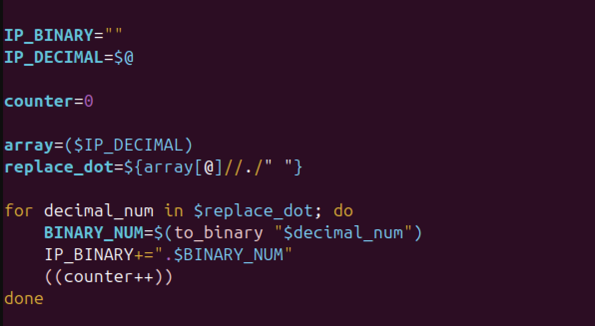
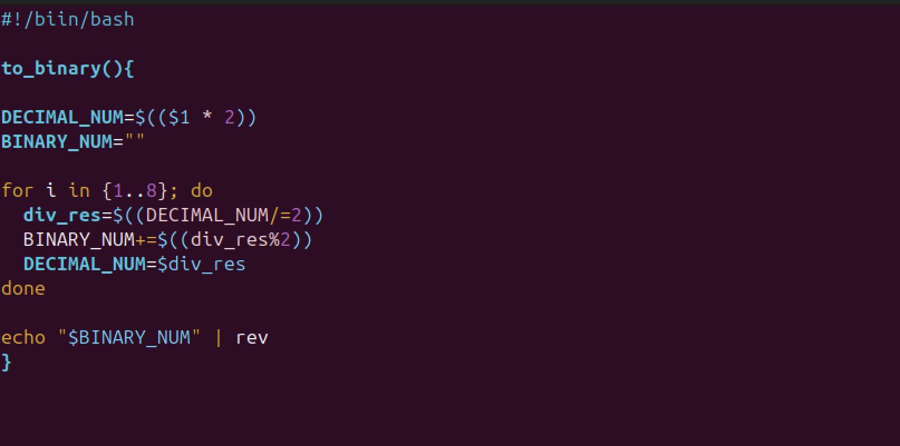
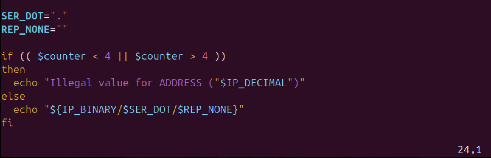
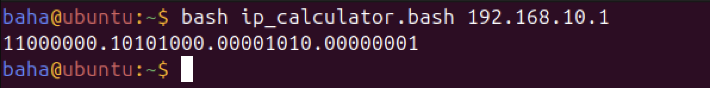
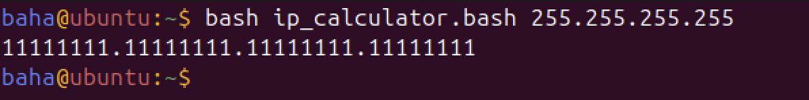
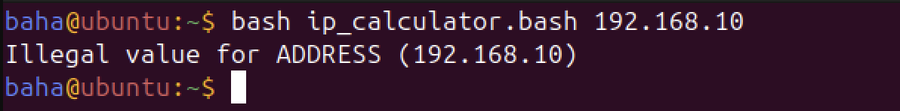
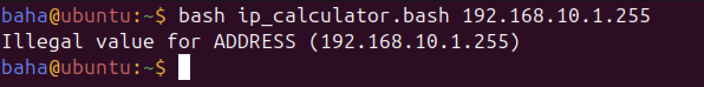

# Лабораторная работа 2

Сделал: `Ахмедов Бахадыр`
## Часть 1

В этой части кода принимаем `ip` адрес из командной строки и сохраняем в переменную `IP_DECIMAL`,из `IP_DECIMAL` создаем массив, используя `array=($IP_DECIMAL)`, из массива `array` заменяем все точки на пробелыл и сохраняем в переменную `replace_dot`, циклом перебираем все элементы которые содержатся в переменной `replace_dot`, и каждый элемент передаем в функцию `to_binary`, результат(полученное двоичное число) функции сохраняем в переменнкю `BINARY_NUM`, дальше сохраняем все числа в двоичной системе в переменную `IP_BINARY`

## Часть 2

Функция `to_binary`(переводит число в двоичную систему) принимает число в десятичной форме и сохраняет его в переменной `DECIMAL_NUM`, функция `to_binary` 8 раз делит число на 2 и сохраняет его в переменной `dev_res`, затем получает остаток числа деленного на 2, и сохраняет в переменную `BINARY_NUM`, заменяет значение переменной `DECIMAL_NUM` на `div_re`, и спользуя команду `rev` переварачиваем число в двоичной системе которое было сохранено в переменной `BINARY_NUM`

## Часть 3

В этой части кода проверяем `ip` адрес на валидность, если `ip` адрес содержить больше 4 или меньше 4 цифр то выводим сообщение об ошибке, елси все правильно выводим `ip` адрес.

## Пример выполнения скрипта 

Вводим `ip` адрес

Вводим `ip` адрес в не коректной форме 

